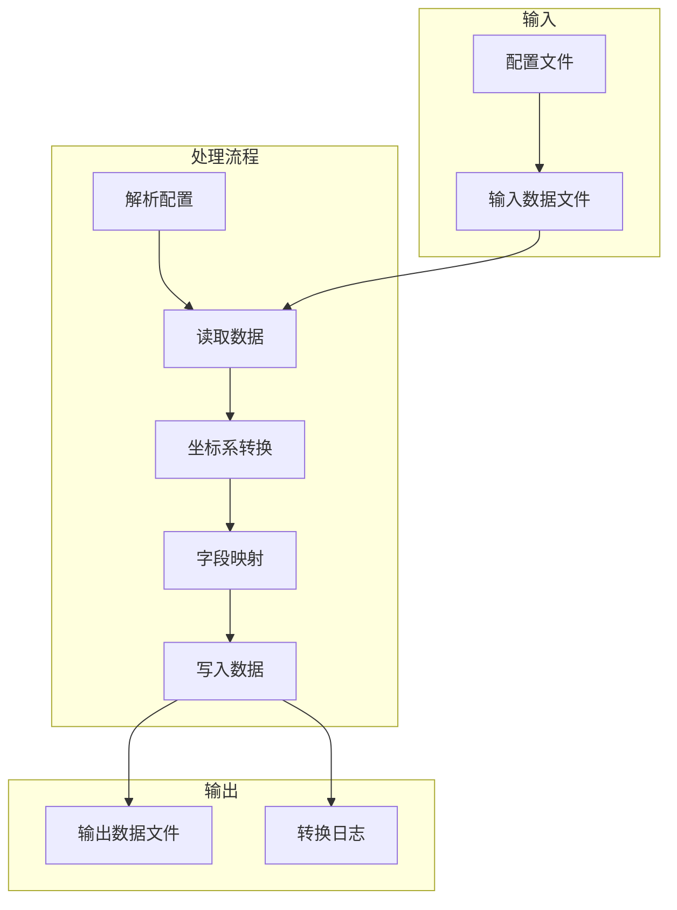

# GeoFieldPipe - 地理数据转换工具

## 📋 项目简介

GeoFieldPipe 是一个功能强大的地理数据转换工具，支持多种格式数据的读写、坐标系转换和字段映射。它提供了命令行和图形界面两种使用方式，满足不同用户的需求。

### ✨ 核心功能

- **多格式数据读写**：支持 Shapefile、GeoJSON、CSV、TIFF/DEM、PostgreSQL/PostGIS、SpatiaLite、KML/KMZ、TopoJSON、DXF 等格式
- **坐标系转换**：基于 EPSG 代码或 WKT 进行精确变换，支持自定义坐标系统
- **字段映射与转换**：表达式驱动的字段映射，支持条件、函数、正则表达式等
- **配置驱动**：所有转换任务通过 JSON 配置文件定义，无需修改代码
- **双模式运行**：同时支持命令行和 GUI 模式
- **3D 几何数据支持**：处理带有 Z 值的几何数据
- **大数据处理**：支持分块处理和并行处理，提高处理效率
- **拖拽式配置**：GUI 支持拖拽字段和函数到表达式编辑器

## 🚀 快速开始

### 安装

#### 从源码安装

```bash
# 克隆项目
git clone <repository-url>
cd geofieldpipe

# 安装依赖
pip install -e .
```

#### 依赖项

| 依赖包 | 版本要求 | 用途 |
|--------|---------|------|
| pyshp | >=2.3.1 | Shapefile 读写 |
| shapely | >=2.0.0 | 几何对象处理 |
| pyproj | >=3.0.0 | 坐标系转换 |
| chardet | >=5.0.0 | 编码自动检测 |
| PyQt5 | >=5.15.0 | GUI 支持 |
| fiona | >=1.9.0 | FileGDB 支持（可选） |
| ezdxf | >=1.0.0 | DXF 支持（可选） |
| rasterio | >=1.3.0 | 栅格数据支持（可选） |
| psycopg2-binary | >=2.9.0 | PostgreSQL/PostGIS 支持（可选） |
| sqlite3 | 内置 | SpatiaLite 支持（可选） |
| simplekml | >=1.3.0 | KML/KMZ 支持（可选） |

### 基本使用

#### 命令行使用

```bash
# 使用配置文件执行转换
geofieldpipe -c config.json

# 详细输出
geofieldpipe -c config.json -v
```

#### GUI 使用

```bash
# 启动图形界面
python -m geofieldpipe
```

## 📁 项目结构

```
geofieldpipe/
├── __init__.py
├── __main__.py               # 统一入口
├── cli.py                    # 命令行入口
├── core/                     # 核心转换逻辑
│   ├── __init__.py
│   ├── orchestrator.py       # 转换编排器
│   ├── io/                   # 数据读写
│   │   ├── __init__.py
│   │   ├── base.py           # 抽象基类
│   │   ├── csv_io.py         # CSV 读写
│   │   ├── geojson_io.py     # GeoJSON 读写
│   │   ├── shp_io.py         # Shapefile 读写
│   │   ├── raster_base.py    # 栅格数据基类
│   │   ├── tiff_io.py        # TIFF/DEM 读写
│   │   ├── cad_io.py         # DXF 读写
│   │   ├── database_io.py    # PostgreSQL/PostGIS 支持
│   │   └── web_io.py         # KML/KMZ/TopoJSON 支持
│   ├── crs/                  # 坐标转换
│   │   ├── __init__.py
│   │   ├── crs_manager.py    # 坐标系统管理器
│   │   └── transformer.py    # 坐标转换器
│   ├── mapping/              # 字段映射
│   │   ├── __init__.py
│   │   └── engine.py         # 字段映射引擎
│   └── processing/           # 数据处理
│       ├── __init__.py
│       ├── chunked_processor.py  # 分块处理器
│       └── parallel_processor.py # 并行处理器
├── gui/                      # PyQt5 界面
│   ├── __init__.py
│   ├── config_editor.py      # 配置文件编辑器
│   ├── main_window.py        # 主窗口
│   └── data/                 # GUI 数据
│       └── coordinate_systems.json  # 坐标系数据
├── utils/                    # 工具函数
│   ├── __init__.py
│   ├── encoding.py           # 编码探测
│   └── validate_config.py    # 配置文件验证
├── examples/                 # 示例文件
│   ├── data/                 # 示例数据
│   └── configs/              # 示例配置
├── data/                     # 测试数据
├── tests/                    # 单元测试
└── output/                   # 输出目录
```

## 📝 配置文件格式

配置文件采用 JSON 格式，包含输入、输出、字段映射和几何配置等部分。

### 基本配置示例

```json
{
  "input": {
    "path": "examples/data/test_data.geojson",
    "format": "geojson",
    "source_crs": "EPSG:4326"
  },
  "output": {
    "path": "output/result.shp",
    "format": "shp",
    "target_crs": "EPSG:3857"
  },
  "field_mappings": [
    {"target": "ID", "expression": "[id]"},
    {"target": "NAME", "expression": "[name]"},
    {"target": "VALUE", "expression": "round([value], 2)"},
    {"target": "X", "expression": "[geometry].x"},
    {"target": "Y", "expression": "[geometry].y"},
    {"target": "CATEGORY", "expression": "iff([value] < 150, 'low', iff([value] < 250, 'medium', 'high'))"}
  ],
  "geometry": {
    "type": "point",
    "output_dimension": "2D"
  }
}
```

### 3D 几何配置示例

```json
{
  "input": {
    "path": "examples/data/test_data.geojson",
    "format": "geojson"
  },
  "output": {
    "path": "output/result_3d.shp",
    "format": "shp"
  },
  "field_mappings": [
    {"target": "ID", "expression": "[id]"},
    {"target": "NAME", "expression": "[name]"}
  ],
  "geometry": {
    "type": "point",
    "output_dimension": "3D",
    "z_source": {"expression": "[elevation]"}
  }
}
```

## 🔧 字段映射表达式

支持以下内置函数：

| 函数 | 描述 | 示例 |
|------|------|------|
| **基础函数** | | |
| `concat(*args)` | 连接多个字符串 | `concat('ID_', [id])` |
| `iff(cond, t, f)` | 条件判断 | `iff([value] > 100, 'high', 'low')` |
| `round(value, digits)` | 四舍五入 | `round([value], 2)` |
| `str(value)` | 转换为字符串 | `str([id])` |
| `int(value)` | 转换为整数 | `int([id])` |
| `float(value)` | 转换为浮点数 | `float([value])` |
| `mod360(value)` | 角度取模 360 | `mod360([angle])` |
| `clean_diameter(value)` | 清理直径字符串 | `clean_diameter([diameter])` |
| `is_zero(value)` | 判断是否为零值 | `is_zero([value])` |
| **正则表达式函数** | | |
| `re_match(pattern, string)` | 从字符串开始处匹配正则表达式 | `re_match('^[A-Z]+', [name])` |
| `re_search(pattern, string)` | 在字符串中搜索正则表达式 | `re_search('\d+', [address])` |
| `re_sub(pattern, repl, string)` | 替换正则表达式匹配的内容 | `re_sub('\s+', '_', [name])` |
| `re_split(pattern, string)` | 按正则表达式分割字符串 | `re_split(',', [tags])` |
| `re_findall(pattern, string)` | 查找所有正则表达式匹配 | `re_findall('\d+', [text])` |
| `re_fullmatch(pattern, string)` | 完全匹配正则表达式 | `re_fullmatch('^\d{5}$', [zipcode])` |
| **日期时间函数** | | |
| `date_parse(date_string, format)` | 解析日期时间字符串 | `date_parse([date], '%Y-%m-%d')` |
| `date_format(date_obj, format)` | 格式化日期时间对象 | `date_format([date], '%Y-%m-%d')` |
| `now(format)` | 获取当前时间 | `now('%Y-%m-%d %H:%M:%S')` |
| `date_diff(date1, date2, format)` | 计算两个日期之间的天数差 | `date_diff([end_date], [start_date])` |
| `add_days(date_string, days, format)` | 向日期添加指定天数 | `add_days([date], 7)` |
| **空间关系函数** | | |
| `intersects(geom1, geom2)` | 判断两个几何对象是否相交 | `intersects([geometry], [buffer])` |
| `contains(geom1, geom2)` | 判断几何对象1是否包含几何对象2 | `contains([polygon], [point])` |
| `within(geom1, geom2)` | 判断几何对象1是否在几何对象2内部 | `within([point], [polygon])` |
| `touches(geom1, geom2)` | 判断两个几何对象是否相接 | `touches([line1], [line2])` |
| `crosses(geom1, geom2)` | 判断两个几何对象是否交叉 | `crosses([line1], [line2])` |
| `overlaps(geom1, geom2)` | 判断两个几何对象是否重叠 | `overlaps([polygon1], [polygon2])` |
| `distance(geom1, geom2)` | 计算两个几何对象之间的距离 | `distance([point1], [point2])` |
| `buffer(geom, distance)` | 对几何对象进行缓冲 | `buffer([point], 100)` |
| `area(geom)` | 计算几何对象的面积 | `area([polygon])` |
| `length(geom)` | 计算几何对象的长度 | `length([line])` |
| **统计函数** | | |
| `sum(values)` | 计算列表的和 | `sum([values])` |
| `avg(values)` | 计算列表的平均值 | `avg([values])` |
| `min(values)` | 计算列表的最小值 | `min([values])` |
| `max(values)` | 计算列表的最大值 | `max([values])` |
| `count(values)` | 计算列表的元素个数 | `count([values])` |
| `median(values)` | 计算列表的中位数 | `median([values])` |
| `std(values)` | 计算列表的标准差 | `std([values])` |

## 📖 示例

### 1. Shapefile 转 GeoJSON

**配置文件**：`examples/configs/test_config.json`

**执行命令**：
```bash
geofieldpipe -c examples/configs/test_config.json
```

### 2. CSV 转 GeoJSON

**配置文件**：`examples/configs/test_config_csv.json`

**执行命令**：
```bash
geofieldpipe -c examples/configs/test_config_csv.json
```

### 3. 3D 几何数据处理

**配置文件**：`examples/configs/test_3d_config.json`

**执行命令**：
```bash
geofieldpipe -c examples/configs/test_3d_config.json
```

## 🏗️ 架构设计

### 架构分层

1. **应用层**：命令行工具和图形界面
2. **转换编排器**：解析配置文件，协调各模块工作
3. **核心服务层**：
   - 数据读写抽象层 (DataReader/Writer)
   - 坐标系转换服务 (CRSTransformer)
   - 字段映射引擎 (FieldMapper)
4. **插件库/第三方依赖**：pyshp, fiona, geopandas, ezdxf, csv, pyproj, shapely

### 工作流程图



## 🎨 GUI 界面

GeoFieldPipe 提供了直观的图形界面，包括：

- **配置文件选择**：支持打开和保存配置文件
- **配置文件编辑器**：可视化编辑字段映射和几何配置
- **字段选择对话框**：方便选择输入字段
- **函数选择对话框**：提供内置函数列表和说明
- **转换进度显示**：实时显示转换进度和日志

## 🔍 故障排除

### 常见问题

1. **编码问题**：如果 Shapefile 中文乱码，工具会自动检测编码
2. **坐标系错误**：确保 EPSG 代码或 WKT 格式正确
3. **字段映射错误**：检查表达式语法和字段名称
4. **几何类型不匹配**：确保输入输出几何类型一致

### 日志输出

命令行模式下，使用 `-v` 参数可以查看详细日志，帮助诊断问题。

## 📚 文档

- **设计文档**：`DESIGN.md` - 详细的架构设计和核心代码说明
- **配置文档**：`CONFIGURATION.md` - 配置文件格式和选项说明
- **示例文件**：`examples/` - 包含示例数据和配置文件

## 🔄 版本更新

### v1.1.0 (最新版本)
- **新增格式支持**：添加 TIFF/DEM 栅格数据、PostgreSQL/PostGIS、SpatiaLite、KML/KMZ、TopoJSON、DXF 格式
- **增强坐标系管理**：添加 CRSManager，支持扩展 EPSG 代码库和自定义坐标系统
- **新增处理能力**：实现分块处理和并行处理，提高大数据集处理效率
- **扩展字段映射**：添加正则表达式、日期时间、空间关系和统计函数
- **GUI 优化**：实现拖拽式配置，支持拖拽字段和函数到表达式编辑器
- **性能优化**：坐标转换精度控制，内存使用优化

### v1.0.0
- 初始版本
- 支持 Shapefile、GeoJSON、CSV 格式
- 实现坐标系转换和字段映射
- 提供命令行和 GUI 两种使用方式

## 🤝 贡献

欢迎提交 Issue 和 Pull Request 来改进 GeoFieldPipe！

## 📄 许可证

MIT License

## 📞 联系方式

如有问题或建议，请通过 GitHub Issues 联系我们。

---

<p align="center">
  <em>GeoFieldPipe - 让地理数据转换更简单</em>
</p>

## 📄 许可证

本项目采用 MIT 许可证，详情请参阅 <a href="LICENSE">LICENSE</a> 文件。

© 2026 zhangjunjie. 保留所有权利。
